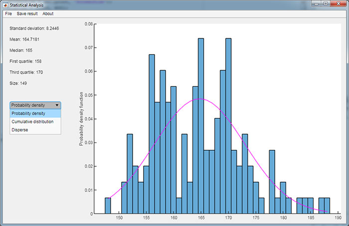

# Statistical analysis tool (Matlab project)
Simple app, which calculates and displays statistical parameters from any representative sample of one-dimension data. 
Allows you to load the input file and save the result in the output txt file or copy it to buffer. 

